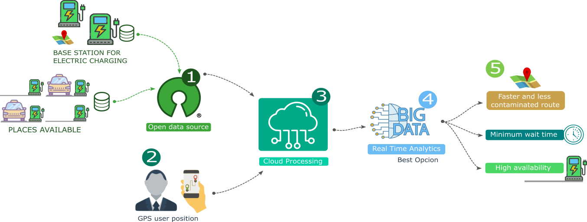
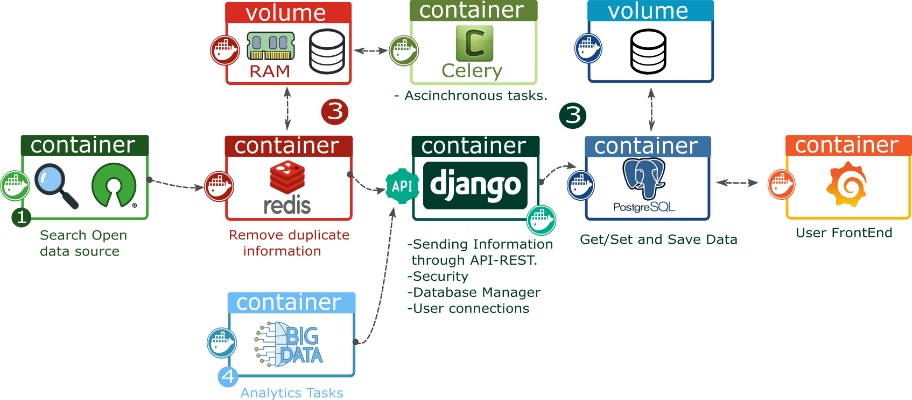

# SMART POWER CHARGE
# Version V1.0

Description This project shows the closest points for charging electric vehicles. Showing A way to integrate high-scalability Open Source technologies.



Version Table:


| Functions                       | v1.0  |
| :---                            | :---: |
| Proyect in gitlab               | OK    |
| Data source             (1)     | OK    |  

OK: Functionality completed
X : Functionality removed.
D : Functionality in development.


## Backend: Using DJANGO [https://docs.djangoproject.com/en/2.2/]
The backend has been done using Django, which is an open-source development framework based on python.
Backend Development using DJANGO [https://www.djangoproject.com/]

## Backend leyout simple using docker.
Below is the proposed Docker-based architecture. It is composed of multiple open-source technologies.





## Instruction for install the backend using Docker-Compose Tools
It is necesary to install thats tools in host server:

1. Docker         [https://runnable.com/docker/install-docker-on-linux]
2. Docker-compose [https://docs.docker.com/compose/install/]
3. Git            [https://git-scm.com/downloads]

### 3.0 Command line for run bakend:

```
# /backend
# DATA_BASE + API-Rest services:
docker-compose -f backend.yml up -d django

```
It is possible check the services
Administrator [localhost:38100/admin/]
Api-Rest services [localhost:38100]

```
user: admin
pasw: admin
```
### 1.0 Simulation of insert data using API-REST and Python libray.

```
docker-compose -f backend.yml up -d data
```

## Translate a Docker Compose File to Kubernetes Resources
link tutorial[https://kubernetes.io/docs/tasks/configure-pod-container/translate-compose-kubernetes/#kompose-convert]

```
kompose --file backend.yml convert
kompose --file backend_v2.yml convert
```
## Kubernetes Dashboards using Windows [http://collabnix.com/kubernetes-dashboard-on-docker-desktop-for-windows-2-0-0-3-in-2-minutes/]
```
kubectl apply -f https://raw.githubusercontent.com/kubernetes/dashboard/v1.10.1/src/deploy/recommended/kubernetes-dashboard.yaml

# Create credentials (Token)
$TOKEN=((kubectl -n kube-system describe secret default | Select-String "token:") -split " +")[1]
kubectl config set-credentials docker-for-desktop --token="${TOKEN}"
```
## Init the services kubernetes:
```
kubectl proxy
```
Access to dashboard to Kubernetes dashboards [http://localhost:8001/api/v1/namespaces/kube-system/services/https:kubernetes-dashboard:/proxy/]

## General Opcion:
```
# delete all pods
kubectl delete pods --all
```
